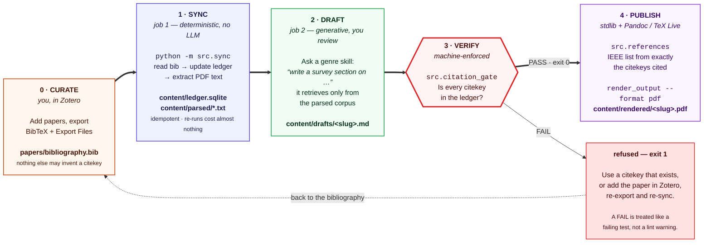
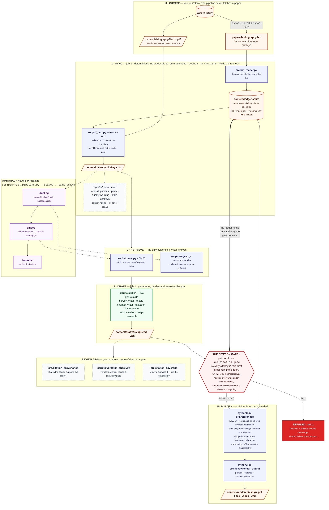

<p align="center">
  <picture>
    <source media="(prefers-color-scheme: dark)"
            srcset="docs/logo-dark.svg">
    
  </picture>
</p>

<p align="center">
Turns a BibTeX bibliography into grounded survey papers, thesis chapters,
undergraduate textbook chapters and hands-on tutorials, with every citation
traceable back to a paper the bibliography actually holds.
</p>

<p align="center">
Named for the Hindu god who keeps the ledger of every deed and audits souls
against it -- which is what this does to citations. <a href="docs/NAME.md">See more</a>.
</p>

---

## The one rule

Fabricated placeholder references have made it into real papers before.
This pipeline is built to make that impossible rather than unlikely:

> **A citekey may only be used if it appears in your own `.bib` export
> *and* was picked up into the ledger by a real parse of a real PDF.**

Everything else in this repository -- the shape of the workflow, which
step is allowed to fail, what the writing skills are permitted to see --
follows from that one rule.

- [How it works](#how-it-works)
- [What makes it different](#what-makes-it-different)
- [Quickstart](#quickstart)
- [Hardware requirements](#hardware-requirements)
- [Architecture](#architecture)
- [The heavy pipeline](#the-heavy-pipeline)
- [Performance](#performance)
- [Documentation](#documentation)
- [Acknowledgements](#acknowledgements)

## How it works

Five phases. You own the first, the machine owns the fourth, and nothing
reaches the fifth without passing it.



Two properties of that picture do all the work:

- **Phase 0 is the only entrance.** Citekeys come from your reference
  manager's BibTeX export. The pipeline never fetches a paper, never
  invents a citekey, and never renames one.
- **Phase 3 is the only exit.** `src.citation_gate` sits on the single
  path between a draft and a rendered document. There is no arrow around
  it, and a `FAIL` is treated like a failing test rather than a lint
  warning.

The same workflow at full detail -- every module, every file it writes,
the optional heavy pipeline and the review aids -- is under
[Architecture](#architecture). [docs/DIAGRAMS.md](docs/DIAGRAMS.md) draws
it eleven times over: six views ordered by how much you already know (one
glance, your first run, the full workflow, everything on disk, gates and
exit codes, the inside of a single parallel parse), three showing how the
genre skills differ in what they ask of the heavy pipeline, and two in the
appendix.

## What makes it different

**Grounding is enforced, not requested.** `python -m src.citation_gate`
fails on any citekey not in the ledger, and a PostToolUse hook runs it on
every write under `content/drafts/` -- so a draft cannot be saved with an
unverifiable citation even if someone forgets to check. Separately, and
deliberately *not* as gates, `python -m src.citation_provenance` reports
what in each cited source actually supports the claim citing it, quoting
a real passage, and `python scripts/verbatim_check.py` finds verbatim
overlap and locates it by page.

**Five genre skills, one set of grounding rules.**
**survey/related-work**; **thesis chapter** (LaTeX fragment, RQ-driven);
**undergraduate textbook chapter** (worked examples and exercises, for a
reader who is studying); **tutorial** (a Diataxis lesson the reader
follows at a keyboard to a working result); and **deep research**
(multi-perspective, corpus-grounded -- a heavier alternative, adapted
from prior work credited in [Acknowledgements](#acknowledgements)). The
two teaching genres are
deliberately separate: a textbook chapter explains, a tutorial is
verified to run. Drafts render to PDF or LaTeX through Pandoc/TeX Live in
IEEE citation style -- numeric `[1]` markers, `[3]–[6]` for a consecutive
run, over a numbered bibliography generated from the citekeys actually
cited. The prose standards all five share, and where they come from, are
in [docs/WRITING-STANDARDS.md](docs/WRITING-STANDARDS.md).

**The content layer is incremental and honest about failure.** `sync`
skips any PDF whose bytes haven't changed, embeddings and topic models
re-encode only what moved, and Docling parsing is fingerprint-cached, so
re-running costs close to nothing. Two PDF backends are supported --
`pdftotext` for speed and page boundaries, `docling` for reading order,
sections and tables -- with a parse-quality guard that catches a backend
silently losing word boundaries. Retrieval is BM25 over the parsed corpus
by default; an embeddings + Chroma path and BERTopic topic modelling sit
behind the optional heavy group. Every stage probes for the binaries and
packages it needs and reports what's missing, rather than crashing or
silently succeeding.

**What it deliberately is not.** Not a paper fetcher -- it never
downloads anything; you curate the bibliography. Not a citation manager.
Not a substitute for reading the sources: the provenance and verbatim
tools exist to help you check the draft, and the gate guarantees a
citekey is *real*, not that the claim attached to it is *right*.

## Quickstart

```bash
# 1. Export Zotero's library
#     BibTeX: papers/bibliography.bib
#     PDF files: papers/pdfs
#    the file path in bibliography.bib must match the relative path
#    Ex: file = {Full Text PDF:pdfs/16/paper-name.pdf:application/pdf}
mkdir -p papers && cp /path/to/your/exported-library.bib papers/bibliography.bib

cp config.toml.example config.toml

# 2. Install dependencies. `all` = OS packages (pdftotext, TeX Live,
#    Pandoc) plus the Python ones; with no stage it installs the Python
#    ones only.
pipx install poetry
bash scripts/install_full_pipeline.sh all

# 3. Sync the content layer from papers/bibliography.bib. A citekey that
#    later drops out of the bib file (a paper removed from your reference
#    manager) is only *reported* by default; re-run with --remove-stale
#    to actually delete its ledger row once you've reviewed the reported
#    list (see "Removing a paper" below) -- not needed on a first run.
source .venv-full/bin/activate
python -m src.sync

# ...and only once you've read the stale list it prints, and agree with it:
# python -m src.sync --remove-stale

# 4. Inspect what it found. Read-only, takes no lock (so it works while a
#    sync is running), and needs no venv.
python3 -m src.ledger

# 5. In Claude Code, ask for a draft, e.g.:
#    "write a survey section on digital twin composability"
#    "draft a thesis chapter on runtime verification for autonomous robots"
#    "write a textbook chapter introducing digital twin asset reuse"
#    "write a tutorial that builds a minimal digital twin asset from scratch"
# The matching skill in .claude/skills/ picks this up automatically,
# including its own citation_gate -> references -> render_output chain

# 6. Manually re-run any step of that chain yourself (no venv needed for any of these)
python3 -m src.citation_gate path/to/draft.md
python3 -m src.references path/to/draft.md --heading "References"    # --heading default: "References"
python3 -m src.heavy.render_output path/to/draft.md --format pdf     # also: --csl, --no-collapse-citations, --documentclass, --fontsize, --margin (--help for all)
python3 -m src.heavy.render_output path/to/draft.md --format md      # numbered Markdown copy in content/rendered/ (no pandoc needed)
```

Exporting from Zotero in detail, including the attachment-path trap that
silently leaves every entry without a PDF, is in
[docs/ZOTERO.md](docs/ZOTERO.md). Every command and which interpreter it
needs is in [docs/CLI.md](docs/CLI.md). Every setting is in
[docs/CONFIG.md](docs/CONFIG.md).

Removing a paper: delete the entry in Zotero, re-export, re-run `sync`.
By default `sync` only *reports* citekeys that dropped out of the bib
file -- it doesn't delete their `content/ledger.sqlite` row until you
re-run with `--remove-stale`. This is deliberate: a bib export that comes
back short a citekey is far more often a botched re-export or `BIB_FILE`
pointing at the wrong path than an intentional deletion, so the default
keeps the ledger untouched until a human confirms. `--remove-stale` still
refuses if the bib file comes back completely empty against a non-empty
ledger, for the same reason -- fix the export or path rather than
deleting everything in one run.

## Hardware requirements

The table below is what the pipeline needs, not what it was developed
on. The specific observations behind it come from two reference
machines, named here because [docs/PERFORMANCE.md](docs/PERFORMANCE.md)
refers back to them -- **treat every measured figure as that machine's,
and expect yours to differ**:

- **the small machine** -- 4 cores, 9.7GB RAM (~3GB actually free), no GPU.
- **the multi-GPU machine** -- 4x NVIDIA A40 46GB, 96 cores (48 available
  to the process), 251GB RAM, driver 555.42.02, verified 2026-07-30.


| Resource | Minimum (core pipeline only) | Recommended (`src/heavy/` in regular use) |
|---|---|---|
| Disk | ~1GB (bibtexparser + content/) | **10-20GB+** -- the full venv alone is **6.0GB** (torch pulled in twice over via sentence-transformers/docling, plus docling's own layout/OCR models); TeX Live adds several GB more on top |
| RAM | ~1-2GB (sync, citation_gate, keyword retrieval are all lightweight) | **8GB minimum, 16GB+ better**. At ~3GB free, Docling parsing a 17-page PDF pushed the process to 3.6GB RSS and the host swapped 6.3GB -- it still finished, just slowly. Bigger PDFs or a bigger corpus will make this worse |
| CPU | 1-2 cores | **4+ cores** without a GPU -- Docling's layout inference and BERTopic's UMAP/HDBSCAN are CPU-bound if there's no GPU to offload to; more cores directly reduces wall-clock time |
| GPU | none needed | **none required**, but if present, `scripts/install_full_pipeline.sh`'s `ensure_gpu_torch` detects the NVIDIA driver's supported CUDA ceiling (`nvidia-smi`) and automatically reinstalls torch from a matching CUDA-tagged wheel index -- verified end-to-end on the multi-GPU machine (driver capped at CUDA 12.5; the default pip/Poetry-resolved torch wheel needed CUDA 13 and silently ran CPU-only until this ran). sentence-transformers/Docling/BERTopic all then use the GPU automatically |
| Network | needed once, for `poetry install` | also needed for first-run model downloads (the embedding model, Docling's layout/OCR models) |

Tips:
- **No GPU, disk tight**: `pip`/Poetry's default torch wheel pulls a full
  set of `nvidia-*` CUDA packages even with no GPU present (several GB,
  unused). Install torch from the CPU-only wheel index first (`pip
  install torch --index-url https://download.pytorch.org/whl/cpu`, inside
  the venv) before running `scripts/install_full_pipeline.sh` if disk is
  tight and there's no GPU to use anyway.
- **GPU present but `torch.cuda.is_available()` is `False`**: this is
  exactly the failure mode `ensure_gpu_torch` (in
  `scripts/install_full_pipeline.sh`) exists to catch and fix
  automatically on every `python-deps`/`dev-deps` run -- it's idempotent
  and safe to re-run by hand:
  ```bash
  .venv-full/bin/python -c "import torch; print(torch.__version__, torch.cuda.is_available())"
  ```
  If it still reports `False` after `bash scripts/install_full_pipeline.sh python-deps`,
  your driver may predate every CUDA wheel tag the script knows about --
  see that function's own comments for the manual fallback.

## Architecture

Two layers -- job 1 (deterministic) and job 2 (generative) in
[AGENTS.md](AGENTS.md)'s terms -- with an optional heavy-pipeline
extension of job 2. The diagram below is the whole system; everything
after it is commentary on one part of it.



Read in the three pieces the rest of this file refers to:

- **Content layer** (job 1: shared, deterministic, safe to run
  unattended) -- boxes 0 through 2. Run via `python -m src.sync`.
  Idempotent and incremental: a paper is only re-parsed if its PDF
  content actually changed, which is what makes the second run nearly
  free.
- **Genre layer** (job 2: generative, on demand, reviewed by you) --
  boxes 3 through 5. Claude Code skills in `.claude/skills/`. Each reads
  the content layer; none of them regenerate it.
- **The heavy pipeline** (`src/heavy/`, `scripts/full_pipeline.py`) -- the
  dotted branch, entirely optional. Every arrow leaving it is dotted
  because every consumer checks the stack exists before using it and
  falls back to the lightweight default if it doesn't.

The thick edge from the ledger to the gate is the whole safety argument:
**the gate consults `content/ledger.sqlite` and nothing else**, so a
citekey no `sync` ever put there cannot survive into a rendered draft.
Every genre skill runs the gate on its own output before presenting a
draft, and refuses to invent a citekey -- see [AGENTS.md](AGENTS.md) for
why this is a hard gate rather than a style suggestion. Once a draft
passes, `python -m src.references` appends (or idempotently replaces) a
"## References" section built only from citekeys the draft already cites,
and `python -m src.heavy.render_output <file> --format pdf` (or
`tex`/`docx`) renders it via Pandoc/TeX Live, resolving `[@citekey]`
markers against `bibliography.bib` -- both stdlib only, no venv required,
same as `citation_gate`.

`papers/bibliography.bib` is the **source of truth** for citekeys and
metadata -- this pipeline parses it, it does not generate its own
citekeys or its own copy of the bibliography. It's a per-host, gitignored
file (every setting, including where it lives, is in
[docs/CONFIG.md](docs/CONFIG.md)), not shipped in the repo, since the PDFs
it points to aren't either. See [AGENTS.md](AGENTS.md) for why, and what
changed if you're looking at content written before 2026-07-28.

Both `sync` and `full_pipeline` take the same lock over `content/`
(`content/pipeline.lock.db`); a second writer exits 2 rather than
interleaving. Readers -- the gate, retrieval, `python3 -m src.ledger` --
are never blocked by it. [docs/DESIGN.md](docs/DESIGN.md) has the
reasoning; [docs/DIAGRAMS.md](docs/DIAGRAMS.md) redraws all of this ten
more ways, including one view built around the failure and exit-code
paths, one around the parallel parse, and three around how the individual
genre skills differ in what they ask of the pipeline.

### What each capability requires

The pipeline probes for what it needs and reports what is missing, so a
machine with only some of these still works -- it just reports the rest
as unavailable rather than failing.

| Capability | What it needs |
|---|---|
| Parse bib file, track citekeys + PDF paths | `bibtexparser` (venv, main Poetry group) |
| Extract PDF text | `pdftotext` (poppler-utils, `os-deps` stage) by default -- `docling` is an opt-in alternative, see [CONFIG.md](docs/CONFIG.md#backend-pdftotext-or-docling) |
| Track parse status incrementally | stdlib `sqlite3` |
| BM25-ranked retrieval | stdlib only |
| Citation verification gate, auto References section, standalone tex/pdf render | stdlib only, no venv needed (see [CLI.md](docs/CLI.md#which-interpreter)) |
| Docling layout-aware parsing, embeddings/Chroma, BERTopic | venv, `heavy` Poetry group (`src/heavy/`) |
| Compiling generated `.tex` chapters to PDF (Pandoc/TeX Live) | `pandoc`, `pdflatex`, `latexmk` (`os-deps` stage) |

Retrieval by default is a BM25 ranker over a disk-cached term-frequency
index (`src/retrieval.py`, stdlib only) -- deliberately: swapping in
`src/heavy/embed_index.py`'s embedding-based search (sentence-transformers
+ Chroma, same `search(query, k)` shape, ready to drop in without
changing callers) is a call to make when BM25 stops being enough for this
corpus, not a threshold this project asserts a number for ahead of time.
The cache is keyed by a cheap per-document fingerprint (parsed-file stat,
not content), so a `search()` call only re-tokenizes documents whose text
actually changed since the last call.

## The heavy pipeline

`scripts/full_pipeline.py` runs Docling -> sentence-transformers/Chroma
-> BERTopic -> Pandoc/LaTeX as one script for both the
host and Docker targets:

```bash
.venv-full/bin/python scripts/full_pipeline.py --stages embed,bertopic
.venv-full/bin/python scripts/full_pipeline.py --stages render --input draft.md
```

Each stage self-probes its prerequisites and reports honestly
(`ok`/`skipped`/`missing-binary`) instead of assuming the target implies
availability -- see `src/heavy/*.py` docstrings for what's been verified
and how. No stage needs an LLM API key -- this repo intentionally has none.
(An earlier revision had PaperQA2 and STORM stages here, both of which
needed `ANTHROPIC_API_KEY` or `OPENAI_API_KEY`; they were removed to keep
this repo API-key-free. Any LLM-backed synthesis now happens only via the
`.claude/skills/` genre layer below, invoked through a Claude Code session
rather than a standalone API call.)

The `render` stage above is just `src/heavy/render_output.py` wired
through `full_pipeline.py`'s corpus-building machinery; if all you want
is to render one draft, `python -m src.heavy.render_output <file>
--format pdf` (bare `python3` -- which interpreter each command needs is
in [docs/CLI.md](docs/CLI.md#which-interpreter)) does the same thing without loading the rest of the heavy pipeline.

### Calling the heavy pipeline from a skill or agent

**Yes, directly -- this is already possible today, and already exercised,
no separate agent layer required.** A Claude Code skill runs inline with
the same Bash tool access as the session invoking it, so any skill can
shell out to `python -m src.heavy.<stage>` or
`python scripts/full_pipeline.py` exactly as a human would. `deep-research`
already does this conditionally: it calls `src.retrieval.search()` by
default but falls back to `src.heavy.embed_index.search()` -- same
`search(query, k, snippet_chars)` signature -- "if that stack has been
built" (checking `content/chroma/` first). `survey-writer` documents the
same conditional upgrade path.

The pattern to follow for any new use: **check the stack exists before
calling into it** (e.g. `content/chroma/` for embeddings, `.venv-full/`
for anything needing the heavy venv at all), and degrade to the
lightweight default rather than erroring if it doesn't -- consistent with
every `src/heavy/*` stage's own self-probing design.

`deep-research`'s three dispatched subagents
(`deep-research-interviewer`, `deep-research-writer`, `peer-reviewer` in
`.claude/agents/`) each also carry Bash tool access, so the same direct
call works from inside them too -- but nothing about calling the heavy
pipeline *requires* going through a dedicated agent. A skill invoked
inline is sufficient by itself.

## Performance

This runs over 501 PDFs / 13,400 pages, and the performance work is
measured rather than asserted -- a full Docling parse went from **1h 56m
to 5m 10s**, both ends measured over the whole corpus. The short version
of how:

- **Parallel parsing**, opt-in via `[parser].workers`, defaulting to
  serial. The worker count is clamped to what the machine can actually
  sustain, counting the CPUs the *process* is allowed rather than the
  machine's total, and workers are forked from a helper process that has
  already imported torch and docling, started early enough to overlap
  with reading the bibliography -- a fixed ~1.5-2s off pool startup,
  which is 9.6% of an eight-document run and under 1% of the full corpus.
  Measured rather than assumed to be more.
- **Multi-GPU**, automatically: each worker claims its own CUDA device,
  because Docling would otherwise put every worker on `cuda:0`.
- **Bounded and interruptible.** Per-document and stalled-run timeouts,
  Ctrl+C that stops in about a second, live progress, and a
  one-writer-at-a-time lock that releases itself if the holder is killed.

Every measured figure, organised by the setting it belongs to, is in
[docs/PERFORMANCE.md](docs/PERFORMANCE.md); how the parallel parse fits
together, component by component, is in
[docs/PARALLELISM.md](docs/PARALLELISM.md); and `bench/` is the harness
that keeps the numbers checkable.

## Documentation

This file is the overview: what the pipeline is, how to get it running,
and what it needs. Everything else lives in one document per question.

**Getting started**

| Document | Answers |
|---|---|
| [docs/ZOTERO.md](docs/ZOTERO.md) | How do I get my library and its PDFs into the shape this expects? Includes the attachment-path trap that silently leaves every entry without a PDF |
| [docs/CLI.md](docs/CLI.md) | What commands are there, what flags does each take, and which interpreter does it need? |
| [docs/CONFIG.md](docs/CONFIG.md) | What settings exist, what values does each accept, and what is the default? Starts with a minimal `config.toml` |

**Choosing settings**

| Document | Answers |
|---|---|
| [docs/PERFORMANCE.md](docs/PERFORMANCE.md) | What does each setting *cost*? Every measured figure in one place, organised by setting |
| [docs/PDF-PARSER.md](docs/PDF-PARSER.md) | Which PDF backend should I use, and why were two others dropped? |

**Understanding the output**

| Document | Answers |
|---|---|
| [docs/WRITING-STANDARDS.md](docs/WRITING-STANDARDS.md) | What prose standards do the genre skills follow, and where in the technical-communication literature do they come from? |
| [docs/CITATION-PROVENANCE.md](docs/CITATION-PROVENANCE.md) | What does the provenance report say, and how do I read it? |
| [docs/DIAGRAMS.md](docs/DIAGRAMS.md) | The workflow drawn eleven ways -- six by depth, three by genre, two in an appendix. Pick the one that matches what you already know |
| [docs/DESIGN.md](docs/DESIGN.md) | How is this put together, and what happens when two runs collide? |
| [docs/PARALLELISM.md](docs/PARALLELISM.md) | How does the parallel parse actually work, what is each component for, and what is planned next? |

**Working on the repository itself**

| Document | Answers |
|---|---|
| [DEVELOPER.md](DEVELOPER.md) | How do I run the tests, where does everything live, and what is unbuilt? |
| [DOCKER.md](DOCKER.md) | How do I run this in a container? |
| [AGENTS.md](AGENTS.md) | The rules a coding agent working here must follow -- above all, never fabricate a citekey |

`bench/` (measurement harness and raw timings) is in the repository but
excluded from the release archive, along with `tests/` and the two files
above it in that table.

## Acknowledgements

- **[hadufer/claude-storm](https://github.com/hadufer/claude-storm)** (MIT
  License) -- the `.claude/skills/deep-research/` skill and its
  `deep-research-interviewer`/`deep-research-writer` subagents adapt its
  7-phase pipeline (perspective discovery, parallel grounded interviews,
  contradiction mapping, outline, cited writing, synthesis, self peer-review).
  Retooled here for a closed, citekey-grounded local corpus instead of live
  web sources -- see `reference.md` in that skill's directory for exactly
  what changed and why.
- **[stanford-oval/storm](https://github.com/stanford-oval/storm)** -- the
  original STORM method claude-storm implements: "Assisting in Writing
  Wikipedia-like Articles From Scratch with Large Language Models" (Shao,
  Jiang, Kanell, Xu, Khattab, Lam; NAACL 2024; arXiv:2402.14207).
- Nav Toor's (@heynavtoor) 4-prompt adaptation, fused into claude-storm's
  pipeline and carried through into `deep-research`'s synthesis-briefing
  and single-reviewer (`quick` depth) peer-review phases.
- **[Imbad0202/academic-research-skills](https://github.com/Imbad0202/academic-research-skills)**
  -- the *idea* behind `deep-research`'s `standard`/`deep`-depth peer review
  (an independent multi-reviewer panel including a dedicated adversarial
  reviewer, reconciled against a concession threshold) is credited to that
  project's Stage-3 peer-review design. That project is licensed CC-BY-NC
  4.0; **no text from it was copied** -- `.claude/agents/peer-reviewer.md`
  and `.claude/skills/deep-research/reference.md` §7 are written from
  scratch, adapting only the concept of an independent panel plus a
  Devil's Advocate role, not its implementation.
