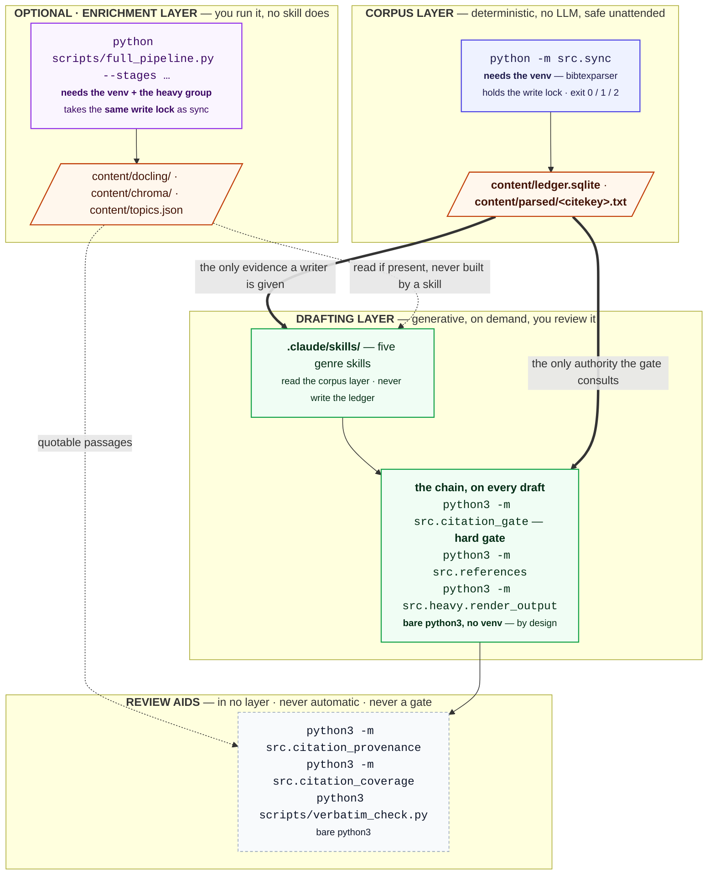

# Architecture

What actually runs, what each part writes, and which parts are optional.

**Written for** someone who has the pipeline working and now wants to
change something: pick a parser backend, decide whether the enrichment
layer is worth building, wire a new script into the chain, or work out why a
command needs a virtual environment when the one next to it doesn't.

**Assumed** you have run [the Quickstart](../README.md#quickstart) at least
once. **Not covered here:** every flag of every command
([CLI.md](CLI.md)), every setting ([CONFIG.md](CONFIG.md)), the internal
design rationale and failure analysis ([DESIGN.md](DESIGN.md)), and how to
work on the repository itself ([DEVELOPER.md](../DEVELOPER.md)).

## Table of contents

- [The three layers](#the-three-layers)
- [Layer 1: the corpus layer](#layer-1-the-corpus-layer)
- [Layer 2: the drafting layer](#layer-2-the-drafting-layer)
- [The enrichment layer](#the-enrichment-layer)
- [Review aids: in no layer](#review-aids-in-no-layer)
- [Incremental by default, honest about failure](#incremental-by-default-honest-about-failure)
- [What this architecture does not do](#what-this-architecture-does-not-do)
- [What each capability requires](#what-each-capability-requires)
- [Which interpreter, and why](#which-interpreter-and-why)
- [Ladders and tiers](#ladders-and-tiers)
- [One writer at a time](#one-writer-at-a-time)

## The three layers

Three layers: a deterministic **corpus layer**, a generative **drafting
layer**, and an optional **enrichment layer** that deepens the corpus for
whoever wants it. (These were called "job 1", "job 2" and "the heavy
pipeline" before 2026-08-06; older content and commit messages still use
those names.) The diagram below adds the axis the workflow diagrams leave
out: **which interpreter each part needs, and who holds the write lock.**



Every module, every file it writes, and the exact edges between them are in
[DIAGRAMS.md's full workflow](DIAGRAMS.md#3-the-full-workflow) -- the same
system at source-reading detail, plus ten other views of it.

Two properties carry the safety argument, and both are visible above:

- **The bibliography is the only entrance.** Citekeys come from your own
  BibTeX export. The pipeline never fetches a paper, never invents a
  citekey, and never renames one.
- **The gate is the only exit.** `src.citation_gate` consults
  `content/ledger.sqlite` and nothing else, so a citekey no `sync` ever put
  there cannot survive into a rendered draft.

## Layer 1: the corpus layer

One command: `python -m src.sync`. It reads `papers/bibliography.bib`,
updates one ledger row per citekey, resolves each PDF from the entry's
`file` field, and extracts text to `content/parsed/<citekey>.txt`.

Three checks ride along, and none of them is fatal: near-duplicate
citekeys, a parse-quality warning when a backend starts losing word
boundaries, and a stale-citekey report. Deletion of a stale row happens
only under `--remove-stale`.

It is idempotent and incremental -- a PDF whose bytes haven't changed is
not re-parsed -- which is what makes the second run nearly free. Exit
codes: `0` clean, `1` at least one parse failed, `2` another writer holds
the lock.

## Layer 2: the drafting layer

Five Claude Code skills in `.claude/skills/`, one set of grounding rules
between them:

| Skill | Produces |
|---|---|
| `survey-writer` | a survey, related-work or background section, topic-clustered, with a comparison table and a gap analysis |
| `thesis-chapter-writer` | a research-question-driven chapter as a standalone LaTeX fragment you `\input` |
| `textbook-chapter-writer` | an undergraduate chapter -- worked examples and exercises, for a reader who is studying |
| `tutorial-writer` | a Diataxis lesson the reader follows at a keyboard to a working result, verified to run |
| `deep-research` | a multi-perspective, corpus-grounded report -- heavier and slower than the others by design |

The two teaching genres are deliberately separate: a textbook chapter
explains, a tutorial is verified to run. The prose standards all five
share, and where in the technical-communication literature they come from,
are in [WRITING-STANDARDS.md](WRITING-STANDARDS.md).

Each skill retrieves from the corpus layer, drafts into
`content/drafts/`, then runs the same three commands on its own output:

1. `python3 -m src.citation_gate <draft>` -- the hard gate. The skill
   loops here, fixing and re-running until it exits 0, and presents
   nothing before that.
2. `python3 -m src.references <draft>` -- an IEEE reference list built from
   exactly the citekeys the draft cites, numbered by first appearance.
   Skipped for thesis `.tex` fragments, where the surrounding LaTeX owns
   the bibliography.
3. `python3 -m src.heavy.render_output <draft> --format pdf` -- the
   rendered output. Citations render IEEE-style: numeric `[1]` markers,
   `[3]-[6]` for a consecutive run, over a numbered bibliography built
   from the citekeys actually cited.

**Grounding is enforced, not requested.** The gate runs twice on the same
draft, and neither run is the skill's own good intentions: a PostToolUse
hook runs it on every write under `content/drafts/`, so a draft cannot be
saved with an unverifiable citation even if a skill forgets to check, and
the skill runs it again before presenting anything.

**What the skills do and do not run for you.** They read the corpus
layer; they never write `content/ledger.sqlite` themselves. Three of the
five (`survey-writer`, `thesis-chapter-writer`, `deep-research`) will run
`python -m src.sync` on your behalf when the ledger is empty or stale, and
say what it found. The two teaching genres don't, because a chapter or a
tutorial cites little enough that an empty ledger isn't a blocker for
them.

**No skill runs the enrichment layer.** They consume its output when a human
has already built it -- `deep-research` checks for `content/chroma/`
before reaching for embedding search, `peer-reviewer` reads
`content/docling/<citekey>.md` if it exists -- and fall back to the
lightweight default when it isn't there. Building that stack is your
decision, not a side effect of asking for a draft. See [the enrichment
layer](#the-enrichment-layer) below.

## The enrichment layer

**It extends the corpus layer, not the drafting one.** That is worth
saying plainly, because the old name for it -- "the heavy pipeline" --
suggested otherwise. Nothing in it is generative and no skill runs it;
every artefact it writes is a deeper reading of the same corpus, which is
also why it takes the *same write lock* as `sync`. The drafting layer only
ever reads what it produced.

`scripts/full_pipeline.py` is the entry point, and it is the only one:

```bash
.venv-full/bin/python scripts/full_pipeline.py --stages docling,embed
.venv-full/bin/python scripts/full_pipeline.py --stages render --input draft.md
```

| Stage | What it produces | Needs `--input`? |
|---|---|---|
| `docling` | `content/docling/<doc>.md` plus a `<doc>.passages.json` sidecar of quotable, reading-ordered passages (and figure bitmaps under `[heavy].docling_images`) | no |
| `embed` | `content/chroma/` -- sentence-transformers vectors per 200-word chunk | no |
| `bertopic` | `content/topics.json` -- one cluster assignment per document | no |
| `provenance` | the citation-provenance report -- the same code as `python3 -m src.citation_provenance`, wrapped for convenience rather than enrichment work | **yes** |
| `render` | the rendered draft -- likewise the drafting layer's own `python3 -m src.heavy.render_output`, wrapped here | **yes** |

Each stage probes its own prerequisites and reports `ok`, `partial`,
`skipped`, `missing-binary` or `error`, so a missing TeX Live is a correct
answer rather than a crash. No stage needs an LLM API key -- this
repository intentionally has none. (An earlier revision had PaperQA2 and
STORM stages that required `ANTHROPIC_API_KEY` or `OPENAI_API_KEY`; they
were removed to keep it key-free. LLM-backed synthesis happens only in the
drafting layer, through a Claude Code session.)

What the three build stages are *for*, and which one to build first, is in
[RETRIEVAL.md](RETRIEVAL.md).

**`--stages` is the only way to run the first three.**
`src/heavy/docling_parse.py`, `embed_index.py` and `topic_model.py` have
no `__main__` block, so `python -m src.heavy.docling_parse` imports the
module, does nothing, and exits 0 -- a silent no-op, not an error.
`src/heavy/render_output.py` is the exception: it has a CLI, needs no
package from the heavy group, and is what the drafting layer calls directly.

**Calling it from a skill or an agent.** A skill runs inline with the same
Bash access as the session that invoked it, so it *can* shell out to
`scripts/full_pipeline.py` exactly as you would. The pattern to follow is
the one the existing skills use: check the stack exists before calling
into it (`content/chroma/` for embeddings, `content/docling/` for
passages, `.venv-full/` for anything in the heavy group), and degrade to
the lightweight default rather than erroring when it doesn't. Bear in mind
what that costs: the enrichment layer takes the same write lock as `sync`,
and
a first full-corpus Docling parse is measured in tens of minutes.

## Review aids: in no layer

Three commands sit outside all three layers. Nothing invokes them automatically,
and none of them gates anything:

| Command | Answers |
|---|---|
| `python3 -m src.citation_provenance <draft>` | what in each cited source actually supports the claim citing it, quoting a real passage |
| `python3 scripts/verbatim_check.py overlap\|locate …` | how much wording a draft shares with a source, and which page a phrase is on |
| `python3 -m src.citation_coverage <draft> --query …` | retrieval surfaced these sources -- did the draft cite them? |

That they are *not* gates is the design, not an omission. The gate answers
a question with one correct answer -- is this citekey in the ledger? --
and can therefore be automatic and absolute. These three answer questions
of judgement, where a machine verdict would be either wrong often enough
to be ignored, or trusted more than it deserves. They give you the
evidence and leave the call to you.

## Incremental by default, honest about failure

Two properties run through every stage, and both are load-bearing rather
than incidental.

**Nothing is recomputed without a reason.** `sync` skips a PDF whose bytes
haven't changed; the embedding index skips a document whose text hashes
the same as what is already stored; the topic model re-encodes only
documents that moved, even though it must re-cluster all of them; the
Docling stage fingerprints each PDF by size and modification time. A
second run over an unchanged corpus therefore costs close to nothing,
which is what makes it safe to put `sync` on a schedule.

**A stage that cannot run says so.** Every stage probes for the binaries
and packages it needs and reports `missing-binary` or `skipped` rather
than crashing or silently succeeding. The parse path adds a quality guard
on top: it warns when a backend starts fusing words together, which is
invisible in a spot check but quietly wrecks keyword retrieval.

## What this architecture does not do

- **It does not fetch papers.** There is no downloader, no metadata API
  client, no crawler. You curate the bibliography; the pipeline reads it.
- **It is not a citation manager.** Zotero (or whatever you export from)
  remains the source of truth for citekeys and metadata. This repository
  parses that export and never writes back to it.
- **It does not verify claims.** The gate guarantees a citekey is *real*,
  not that the sentence attached to it is *right*. That is what the review
  aids above are for, and they are aids -- reading the source remains your
  job.

## What each capability requires

The pipeline probes for what it needs and reports what is missing, so a
machine with only some of these still works. It reports the rest as
unavailable rather than failing.

| Capability | What it needs |
|---|---|
| Parse bib file, track citekeys and PDF paths | `bibtexparser` (venv, main Poetry group) |
| Extract PDF text | `pdftotext` (poppler-utils, `os-deps` stage) by default -- `docling` is an opt-in alternative, see [CONFIG.md](CONFIG.md#backend-pdftotext-or-docling) |
| Track parse status incrementally | stdlib `sqlite3` |
| BM25-ranked retrieval | stdlib only |
| Citation gate, References section, tex/pdf render | stdlib only, no venv (see [below](#which-interpreter-and-why)) |
| Docling layout-aware parsing, embeddings/Chroma, BERTopic | venv, `heavy` Poetry group |
| Compiling generated `.tex` to PDF | `pandoc`, `pdflatex`, `latexmk` (`os-deps` stage) |

## Which interpreter, and why

Three tiers, on purpose. [CLI.md](CLI.md#which-interpreter) lists which
tier each command is in; this is the reason there are tiers at all.

| Tier | Needs | Commands |
|---|---|---|
| 1 | bare `python3`, stdlib only | `citation_gate`, `references`, `heavy.render_output`, `ledger`, `citation_provenance`, `citation_coverage`, `scripts/verbatim_check.py` |
| 2 | venv + `bibtexparser` | `src.sync` |
| 3 | venv + the `heavy` group | `scripts/full_pipeline.py` |

**The gate chain is deliberately in tier 1.** `citation_gate` ->
`references` -> `render_output` runs on the system interpreter with no
third-party import anywhere in it, so the pipeline's one safety guarantee
cannot be blocked by a virtual environment that is broken, absent, or
built for a different Python. That matters more than it sounds: PEP 668
blocks `pip install` outside a venv on most current distributions, so "the
venv is broken" is not always a five-second fix.

Tier 2 is one package. `src.sync` needs `bibtexparser` because parsing
BibTeX correctly -- nested braces, LaTeX escapes, multi-line values -- is
not worth hand-rolling.

**Directory membership is not the same axis.**
`src/heavy/render_output.py` lives under `src/heavy/` and is in tier 1: it
needs no package from the heavy group at all. What it needs is `pandoc`
and `pdflatex`, which are operating-system packages, probed at runtime and
reported as `missing-binary` when absent. A module's directory says which
pipeline it belongs to, not which interpreter runs it.

## Ladders and tiers

Both words appear across these docs, and they are not the same thing.

A **ladder** is an ordered chain the code walks *automatically*: it tries
the first rung, and falls to the next when that one can't answer. A
**rung** is one option in such a chain.

| Ladder | Rungs, best first | Where |
|---|---|---|
| Evidence passages | docling `.passages.json` -> parsed text split on page breaks -> a fresh `pdftotext` run | `src/passages.py` |
| Enrichment text source | `content/docling/<id>.md` -> the ledger's parsed `.txt` -> a fresh `pdftotext` run | `embed_index.get_text` |
| Accelerator | one CUDA device per worker -> that worker falls back to the CPU on an out-of-memory error | `src/pdf_text.py` |

A **tier** is a menu you choose from, with no automatic descent. Naming
these apart matters because the failure modes differ: a ladder degrades
quietly and you may not notice, while a tier fails loudly and tells you
what is missing.

| Tier set | Options | What happens if the one you picked is unavailable |
|---|---|---|
| Parser backend | `pdftotext`, `docling` | `sync` warns and skips parsing. It does **not** silently substitute the other backend |
| Interpreter | the three tiers above | `ModuleNotFoundError` |
| Render format | `md` (no binary), `tex`/`docx` (pandoc), `pdf` (pandoc + pdflatex) | reported as `missing-binary`. No format is silently downgraded to another |

## One writer at a time

`sync` and `full_pipeline.py` take the same lock over `content/`
(`content/pipeline.lock.db`), because the unsafe overlap is any writer
against any other writer, not just sync against sync. The second one to
start exits `2` rather than interleaving, and the lock releases itself if
its holder is killed.

Readers are never blocked: `python3 -m src.ledger`, the citation gate and
retrieval all run happily while a sync is in progress.
[DESIGN.md](DESIGN.md) has the reasoning and the failure analysis.
