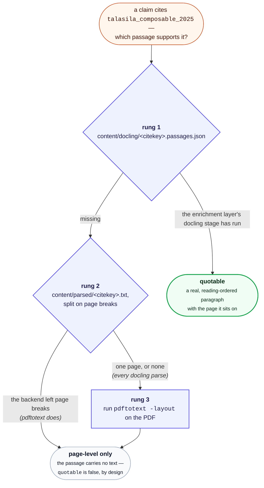

# Citation provenance

Status: **implemented.** Written 2026-08-01.

## Background: what this repository does

Skip this section if you already know the codebase.

This project turns a personal reference library into cited prose. It runs
as two layers that never mix.

**The corpus layer is deterministic and has no AI in it.** You export a
`.bib` file
from your reference manager. `python -m src.sync` reads it, records every
entry in a small SQLite "ledger" (`content/ledger.sqlite`), and extracts
each attached PDF's text into `content/parsed/<citekey>.txt`. Nothing is
generated; the bib file is the source of truth.

**The drafting layer drafts documents**, on demand, using those extracted
sources.

A **citekey** is the identifier BibTeX assigns an entry -- for example
`larsen_engineering_2024`. In a draft it appears as `[@larsen_engineering_2024]`.
The project's one hard rule is that **a citekey may only be used if it
came from the bib file**, because fabricated references have made it into
real published papers before. `python -m src.citation_gate` enforces this
mechanically: it extracts every citekey from a draft and fails if any is
absent from the ledger. That is a *gate* -- drafting is blocked until it
passes.

Some tools in the repo are gates. Others are **review aids**: they report
something for a human to judge, and never block. The distinction matters
a lot below.

Two other terms used here:

- **Parser backend** -- how a PDF becomes text. `pdftotext` (fast, the
  default) or `docling` (slow, layout-aware). Set in `config.toml`.
- **The enrichment layer** -- optional, opt-in stages under `src/enrich/`
  run by `scripts/enrich.py`: layout-aware Docling parsing,
  embeddings, topic modelling, and rendering to PDF/LaTeX.

## The problem

You are reading a draft. A sentence carries a citation:

> Simulation has become a cornerstone of developing and validating these
> systems [@zampetti_continuous_2023].

You have a doubt. Not "is this citekey real?" -- `citation_gate` already
answers that, and answers it as a hard gate. The doubt is different and
harder:

**Does the cited paper actually say this?**

Right now, answering that means opening the PDF and reading until you
find the passage, or convincing yourself it isn't there. That is slow
enough that in practice it doesn't get done, which means the failure it
would catch -- a claim that drifted away from its source during drafting
-- ships.

### Why the existing tools don't cover it

The repository already has two review aids, and neither answers this
question.

`src/citation_coverage.py` asks the inverse: *of the sources retrieval
surfaced for a query, which ones did the draft actually cite?* That
finds sources you missed. It says nothing about whether the ones you did
cite support what you wrote.

`scripts/verbatim_check.py` is closer but needs you to already know the
answer's shape. Both its modes take the citekey as an argument:

- `overlap <draft> <citekey>` -- longest verbatim word runs shared
  between the paragraphs citing that key and the source.
- `locate <citekey> "<phrase>"` -- which page a phrase appears on.

So it verifies a suspicion you have already formed about a specific
citekey. It cannot tell you *which* of a draft's forty citations deserve
suspicion in the first place.

There is also a subtler gap. `cmd_overlap` matches **exact word n-grams
(default n=8)**. That is the right tool for its actual job -- catching
borrowed wording, i.e. accidental plagiarism -- but it is the wrong tool
here. A correctly paraphrased claim shares *no* 8-word run with its
source and scores zero, indistinguishable from a claim the source never
made. The failure mode we care about is precisely the paraphrased one.

## What is being asked for

A **citation provenance document**: for a given draft, a report that
walks every citation and shows what in the source supports it, so a
human reading the draft can jump straight to the doubtful ones.

Explicitly a manual review step, run when you want it. Not a gate, not
part of any automatic chain.

## The solution, as built

```
python -m src.citation_provenance content/drafts/<slug>.md
```

Writes `content/provenance/<slug>.provenance.md`, plus `.tex` and `.pdf`
renders of the same report when `pandoc`/`pdflatex` are available. It is
also a stage of the enrichment layer:

```
python scripts/enrich.py --stages provenance --input content/drafts/<slug>.md
```

For each citing passage in the draft, emit:

| Field | Meaning |
|---|---|
| Draft location | Line number and the citing sentence |
| Citekey | The key cited there |
| Best-matching source passage | The span of that paper's text closest to the claim |
| Page | Where that passage sits in the PDF |
| Score | How strong the lexical match is |
| Flag | Explicit **NO SUPPORT FOUND** when nothing clears a floor |

Sorted **worst match first**, so the report opens on the citations most
worth your attention rather than making you read forty entries to find
three.

### Design decisions

**A review aid, not a gate.** This mirrors `citation_coverage.py`'s
stated position exactly. The reason is not caution for its own sake: a
lexical matcher cannot tell "this claim is unsupported" from "this claim
is supported in vocabulary the matcher didn't recognise". Anything that
*blocks* on that distinction would train people to work around it, which
is precisely the corrosion `citation_gate` avoids by only ever asserting
something it can check exactly -- ledger membership.

**Lexical overlap, not exact n-grams.** Scoring should follow
`cmd_locate`'s approach -- distinctive words from the claim, counted
against the words in each candidate source passage -- not `cmd_overlap`'s
verbatim runs. A paraphrase keeps most of its content words while
changing their order and function words, so overlap scoring degrades
gracefully where n-gram matching falls off a cliff. Stopwords should be
dropped, as `src/retrieval.py` already does.

**Page numbers come from the PDF, not the parsed text.** `verbatim_check.pages()`
already re-runs `pdftotext -layout` on the original PDF and splits on
form feeds, which means page resolution works regardless of which parser
backend produced `content/parsed/`. That indirection is worth keeping.

**Stdlib only.** `citation_gate.py`, `references.py` and
`citation_coverage.py` all run under bare `python3` with no venv. This
tool reuses `citation_gate.extract_citekeys` (which returns
`(line_number, citekey)` pairs -- the line numbers are exactly what the
report needs) plus `verbatim_check`'s `pages()` and `norm()`, all of
which are already stdlib-only. There is no reason for this one to be
heavier.

### Prerequisite: already cleared

This proposal was blocked until v0.9.0. `verbatim_check.pdf_path()`
resolved only **305 of 501** PDFs, for two independent reasons -- it
took the description segment of the bib `file` field instead of the path,
and `bib_entry()` truncated entries at the first `\n}`, which also occurs
inside multi-line field values. A provenance report built on that would
have said "no source text" for 39% of the corpus, which is worse than
saying nothing: it looks like a finding.

Both are fixed. All 501 now resolve.

## What this deliberately does not do

**It does not judge whether the claim is true**, or whether the citation
is appropriate. It surfaces the evidence and leaves the judgment where it
belongs.

**It does not call an LLM.** Everything in the deterministic half of this
pipeline (the corpus layer) is local and reproducible; a semantic matcher
would be
both non-deterministic and a new dependency, for a tool whose output a
human reads anyway.

**It will not catch every drift.** A claim paraphrased into genuinely
different vocabulary can score low despite being well supported, and a
claim that shares vocabulary with its source can score high while
misrepresenting it. The report is a reading order, not a verdict. This is
the honest limit of lexical matching, and the reason the tool warns
rather than gates.

## The Docling provenance sidecar

Docling's document model carries full provenance -- verified on a real
17-page paper, **336 of 336 text items** had both a page number and a
bounding box, plus a semantic label. `export_to_markdown()` discards all
of it; Docling never loses it.

It is tempting to read this as a straight upgrade to the report's
*pointing*: cite an exact rectangle instead of a page. That part is
genuinely marginal -- a reviewer opening a PDF at page 7 finds the
passage in seconds, and a bounding box only pays off if something
renders a highlight, which nothing here does.

The real argument is different, and it exposes a hole in the plan above.

### Reading order, and why it matters more than coordinates

`pdftotext -layout` preserves the *visual* arrangement of a page, not its
reading order. On a two-column paper that means two unrelated columns
share each output line:

```
Ning and Wang provided an architecture of Future Internet    sequences transduce into different power management plan
of Things (IoT) using human neural network structure [10].   sequences. They used Moore's machine to represent power
```

Those are two different discussions, interleaved. Measured across the
10-paper sample:

| Papers | Long lines carrying two columns |
|---|---|
| 4 of 10 | **82%-89%** |
| 6 of 10 | 3%-9% (single-column; residue from tables) |

So roughly **40% of this corpus cannot yield a clean quotable passage**
from `content/parsed/` at all. Any window drawn over that text is a
splice of two arguments.

### What this does and doesn't break

The distinction that matters is between *scoring* and *quoting*.

**Page-level locating survives interleaving.** `cmd_locate` scores a
page by how many distinctive words from the phrase appear anywhere in
it -- a bag of words, order-independent. Column splicing moves words
around within a page; it doesn't move them to a different page. So
page-level matching works on all ten papers today, unchanged.

**Passage quoting does not survive it.** The "best-matching source
passage" field in the report above would, on those four papers, show a
reviewer two spliced half-sentences. That is worse than showing nothing,
because it reads as evidence.

Docling fixes exactly this: its text items are reading-order-resolved and
semantically labelled, so a passage is a real passage. The bounding box
arrives in the same sidecar, essentially free, but it is the reading
order that carries the value.

### Revised plan

**Phase 1 -- lexical matcher, page-level report.** Ship the tool above
with the passage field reduced to page-plus-score, or shown only for
documents detected as single-column. Works for 100% of the corpus, needs
no Docling run, stays stdlib-only.

**Phase 2 -- Docling passage sidecar, if quoting proves necessary.**
Persist `{text, label, page, bbox}` per item during the enrichment layer's
Docling stage, and score against those items instead of flat windows. Buys real
quotable passages, section-level context ("in §2.2 Structural Design
Process", often more useful to a human than a page number), exclusion of
running heads and footers from scoring, and bbox highlighting for free.

Phase 2 is not an alternative to Phase 1: it improves the *evidence
display* and leaves the matching problem exactly where it was. A precise
rectangle around a badly-matched paragraph is worse than a page number,
because false precision invites trust.

### Costs of Phase 2

- A full Docling pass over the corpus: ~26s/paper measured, so **~3.6
  hours** for 501 papers, and it is not incremental across a
  re-parse when options change.
- `content/parsed/` stays authoritative for retrieval, so the sidecar is
  a second text representation to keep in sync with it.
- `content/docling/` is currently read only by `src/enrich/embed_index.py`;
  this adds a second consumer to an opt-in stage.
- The default backend is `pdftotext` and the Docling stage is opt-in, so
  the tool needs the Phase 1 path regardless -- Phase 2 can only ever be
  an enhancement for users who have paid the Docling cost, never a
  replacement.

## What the corpus layer discards when it uses docling

Docling appears twice in this repository, for two different purposes, and
the two do not share their work. The corpus layer's parser
(`[parser].backend = "docling"`) and the enrichment layer's `docling` stage
are independent consumers of the same library. That has a consequence for
provenance that is worth stating plainly, because it runs against
intuition: **choosing the better parser here does not give you better
quotations, and on its own it gives you worse ones.**

When `sync` parses with Docling it builds the full document model --
verified on a real 17-page paper, 336 of 336 text items carried a page
number, a bounding box and a semantic label -- and then keeps only
`export_to_markdown()`, writing that string to
`content/parsed/<citekey>.txt`. Reading order survives inside the text.
Page numbers, labels and boxes do not; the document object is discarded.

Follow what the passage ladder then does:



A corpus-layer Docling parse writes Markdown, which carries no form feeds, so
rung 2 sees a single page and declines. The ladder falls to rung 3 and
re-extracts the PDF with `pdftotext` -- the tool whose column splicing
this whole section exists to work around. Two further consequences follow
from the same missing page breaks: `scripts/verbatim_check.py locate`
reports `pdf p.1` for every hit on such a citekey, and a later
`--stages docling` run re-parses those same PDFs from scratch, because the
enrichment stage keeps its own cache and has no way to know the corpus
layer already did
the work.

**What to do about it today.** If you want quotable passages, run the
heavy stage: `enrich.py --stages docling` writes the
`<citekey>.passages.json` sidecar that rung 1 wants, whichever backend
the corpus layer used. If you are not going to run it, `[parser].backend =
"pdftotext"` (the default) keeps page-level locating working, which is the
better of the two remaining rungs. The combination that helps least is
Docling in the corpus layer with no enrichment stage: you pay the slowest
parse and land on rung 3 anyway.

The fix -- having the corpus layer write the sidecar from the document
model it already holds, rather than throwing it away -- is recorded as a known gap
in [DEVELOPER.md](../DEVELOPER.md#open-questions-and-unbuilt-features).

## Worked example

Run against a real 13-citation draft over a 10-paper corpus, the report
opens like this:

```markdown
## Summary

- 8 weak
- 5 supported

## Findings

### Weak

#### Line 29 -- `[@aldalur_microservice-based_2024]` (40% match)

> A cyber-physical system is a program whose input is the physical world
> and whose output *changes* that world -- a definition captured in the
> literature as systems that "integrate digital cyber computations with
> physical processes", or equivalently as combinations of computing and
> physical processes.

Best match is on **page 2** of the source.
```

With a Docling sidecar present, that last line is replaced by the actual
paragraph from the paper.

## A calibration caveat, found by running it

Scores are comparable *within* a passage source, not across them. A
quoted paragraph is a far smaller haystack than a whole page, so the
same quality of support scores lower against a paragraph.

On one real 13-citation draft, the identical citations banded as **8
weak / 5 supported** with page-level fallback, and **12 weak / 1
supported** once Docling paragraphs were available. The matches did not
get worse; the denominator got smaller.

This is why the bands are described as a reading order rather than a
measurement, and why the report says so in its own header. A single
absolute threshold that meant the same thing for both sources would
require normalising by passage length, which buys precision the tool
does not claim to have.

## One thing the build got wrong first

Worth recording, because it is the kind of defect only a real run finds.

The first implementation read the citing **line** to recover the claim.
Every draft this project produces is hard-wrapped, so a sentence spans
three or four lines and the citation lands on whichever one happens to
hold it. The report came out full of claims like `.` and `, or
equivalently as combinations of` -- fragments that match nothing, scoring
0% and reporting five false "no support found" findings.

Claims are now reconstructed from the whole paragraph, then split into
sentences with an abbreviation-aware splitter (so `Fig. 1` and `e.g.`
don't create the same problem one level down). The same draft went from
5 spurious "no support found" to 0.

## Sizing (as built)

| Piece | Actual |
|---|---|
| `src/citation_provenance.py` | ~250 lines |
| `src/passages.py` | ~150 lines |
| `_passage_records` in `src/enrich/docling_parse.py` | ~35 lines |
| Tests | ~55 cases |

No new dependencies. No changes to `sync`, `citation_gate`, or the
render chain beyond calling it.

The sidecar -> form-feed pages -> `pdftotext` ladder, and the rule that a
source with no reading order reports a page rather than a quotation, live
in `src/passages.py` rather than here. That split happened when retrieval
became the second consumer: a snippet shown to a drafting agent *as
evidence* is under exactly the same constraint as a passage shown to a
reviewer, and the two must not answer "what does this source say here?"
from different text. `citation_provenance` still owns everything above
the ladder -- which sentence carries a citation, how it scores, how the
report reads.
