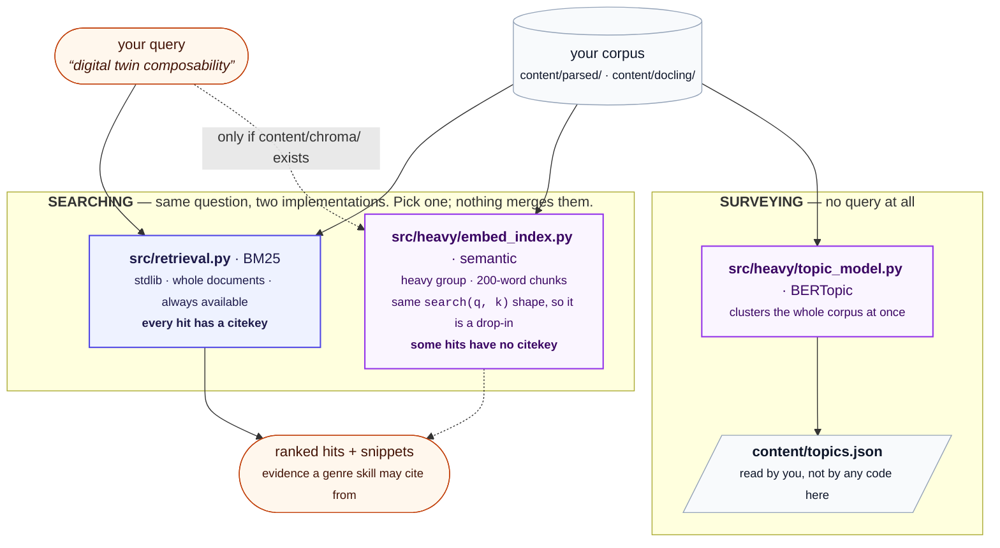

# Retrieval: BM25, embeddings, and topic models

Three things in this repository search or organise your corpus. Two of
them answer the same question in different ways, and the third answers a
different question entirely. This document says which is which, so you can
decide what is worth building.

**Written for** someone choosing whether to run
`scripts/full_pipeline.py --stages embed,bertopic`, or wondering why a
draft cited a paper they didn't expect. **Assumed:** you have run
`python -m src.sync` and have a populated ledger. **Not covered:** how to
tune any of them -- see [CONFIG.md](CONFIG.md) for the settings and
[PERFORMANCE.md](PERFORMANCE.md) for what each costs.

## The short answer

| | **BM25** | **embeddings** | **topic model** |
|---|---|---|---|
| Module | `src/retrieval.py` | `src/heavy/embed_index.py` | `src/heavy/topic_model.py` |
| Question it answers | which sources match this query? | *the same question* | what clusters exist in my corpus? |
| Takes a query | yes | yes | **no** |
| Method | Okapi BM25 over whitespace tokens | dense vectors, cosine distance | UMAP then HDBSCAN over one vector per document |
| Unit of a hit | a whole document | a 200-word chunk | a whole document |
| Corpus | ledger rows only | ledger rows **and** `papers/pdfs/` | ledger rows **and** `papers/pdfs/` |
| Every hit citable? | **yes** | **no** -- see below | n/a |
| Needs | stdlib, bare `python3` | venv + `heavy` group + a model download | venv + `heavy` group |
| Used by | every genre skill, by default | `survey-writer`, `deep-research` (only if built) | **nothing in this repository** |



## BM25 -- the default, and always available

`src/retrieval.py` ranks whole documents by Okapi BM25 over
whitespace-separated tokens, with the usual constants (`k1 = 1.5`,
`b = 0.75`). It is stdlib-only: no model download, no venv, nothing to
build. `search(query, k)` returns
`SearchResult(citekey, title, score, snippet)`, and the snippet is a
window of the real text around the matched terms, so a skill can judge
relevance itself rather than trusting a score.

Two properties matter when you compare it with the alternative:

- **Every hit is citable.** It reads the ledger, so every result already
  has a citekey that `citation_gate` will accept.
- **It reads `content/parsed/<citekey>.txt` and nothing else.** Running
  the enrichment layer's `docling` stage does not improve BM25 --
  `content/docling/` is not on its read path. The only way Docling's output reaches keyword
  retrieval is `[parser].backend = "docling"` in the corpus layer, which
  changes what
  `sync` writes into `content/parsed/`. (That choice has a cost of its own:
  see [CITATION-PROVENANCE.md](CITATION-PROVENANCE.md#what-the-corpus-layer-discards-when-it-uses-docling).)

Term-frequency statistics are cached to `content/retrieval_index.json`,
keyed by a cheap per-document fingerprint (the parsed file's size and
mtime, not its content), so a call only re-tokenizes documents whose text
changed.

## Embeddings -- a replacement for BM25, not an addition

`src/heavy/embed_index.py` chunks each document into 200 words with
40 words of overlap, encodes each chunk with a sentence-transformers model
(`sentence-transformers/all-MiniLM-L6-v2` by default), and stores the
vectors in a Chroma collection under `content/chroma/`. The collection is
namespaced by model name, so switching models starts a fresh collection
instead of mixing dimensions.

It is designed as a **drop-in**: `search(query, k, snippet_chars)` has the
same shape as BM25's, so callers do not change. Nothing in this repository
fuses or re-ranks the two -- there is no hybrid search here. A skill uses
one or the other.

**When it earns its cost.** BM25 cannot match a paper that argues your
point in different words. If your corpus is large, or written across
communities that use different vocabulary for the same idea, semantic
recall is the reason to build this. On a small, vocabulary-consistent
corpus, BM25 is usually enough -- which is why it stays the default.

**The one hazard: not every hit is citable.** The enrichment layer's corpus
is wider than the ledger. It includes any raw PDF you dropped into
`papers/pdfs/`, which has no bibliography entry and therefore no citekey.
Those results come back with `citekey: ""` and a `doc_id` like
`doc:some-paper`, and they can never be cited: `citation_gate` checks
membership in the ledger, and a `doc:` identifier can never be a BibTeX
citekey. Read them freely -- but to cite one, add the paper to your
reference manager, re-export, and re-run `sync`.

`full_pipeline.py` counts them at the top of every run, before any stage
touches them, so you know how much of what you are about to index cannot
be cited:

```
  NOTE 3 document(s) from papers/pdfs have no bib entry, so they have no
  citekey and can never be cited.
```

A raw PDF that the ledger *already* covers -- the same file, or a
byte-identical copy under another name -- is skipped instead of indexed
twice, and named:

```
  skipped rossi-2023.pdf: same PDF as rossi_composable_2023, which is
  already in the ledger.
```

That is the case that used to be silent, and it arises normally: catalogue
a raw PDF in your reference manager, re-export, re-run `sync`, and the
copy still sitting in `papers/pdfs/` is now a duplicate of a citable row.

**Who uses it.** `survey-writer` and `deep-research` name it as the
alternative to BM25, and `deep-research`'s subagents check that
`content/chroma/` exists before reaching for it. The other three genre
skills use BM25 only.

## Topic model -- a different question

`src/heavy/topic_model.py` takes no query. It embeds each document once as
a whole, reduces with UMAP, clusters with HDBSCAN, and writes
`content/topics.json`: one topic assignment per document, plus a topic
table. It needs at least two documents with text.

Three things to know before you run it:

- **Nothing in this repository reads `content/topics.json`.** No module,
  no genre skill. It is written for you to read when deciding what a
  survey should even be about. `survey-writer` groups its themes by
  judgement over the evidence it retrieved, and says so explicitly.
- **All-outliers is a correct answer on a small corpus.** HDBSCAN's
  default minimum cluster size will legitimately put every document in
  topic `-1` when there are few of them. Don't force clusters into
  existence by lowering it; the honest result is that the corpus is not
  yet big enough for the question.
- **It is the one stage that cannot be incremental.** Clustering is
  whole-corpus by nature -- adding a document can move every assignment.
  Only the encoding is cached (`content/topic_embed_cache.json`, keyed by
  text hash and model name), never the clustering.

## Which should I build?

| If you want to… | Do this |
|---|---|
| Draft from a modest, consistent corpus | Nothing. BM25 is already running |
| Quote sources accurately in a review | `--stages docling` -- it is the passage sidecar, not the ranker, that improves quoting |
| Find papers that argue your point in other words | `--stages docling,embed` |
| Decide what your survey should cover | `--stages docling,embed,bertopic`, then read `content/topics.json` yourself |

`docling` comes first in each of those because the embedding stage prefers
`content/docling/<doc>.md` over the plain parsed text when it exists --
better reading order in, better chunks out.
